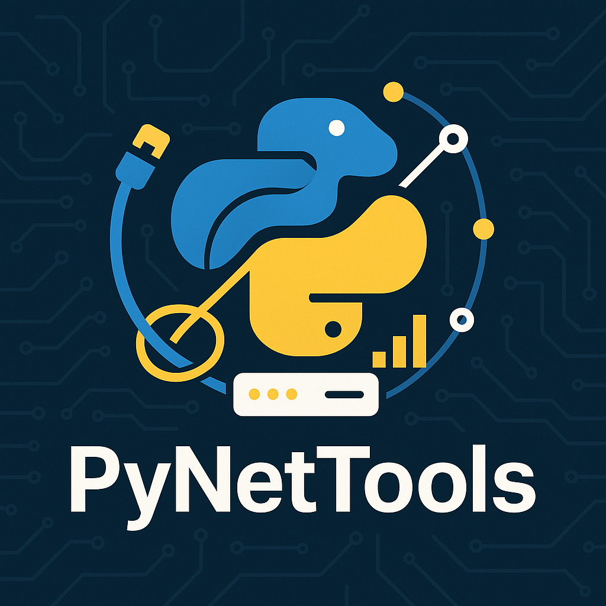
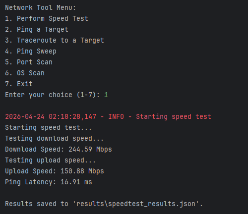
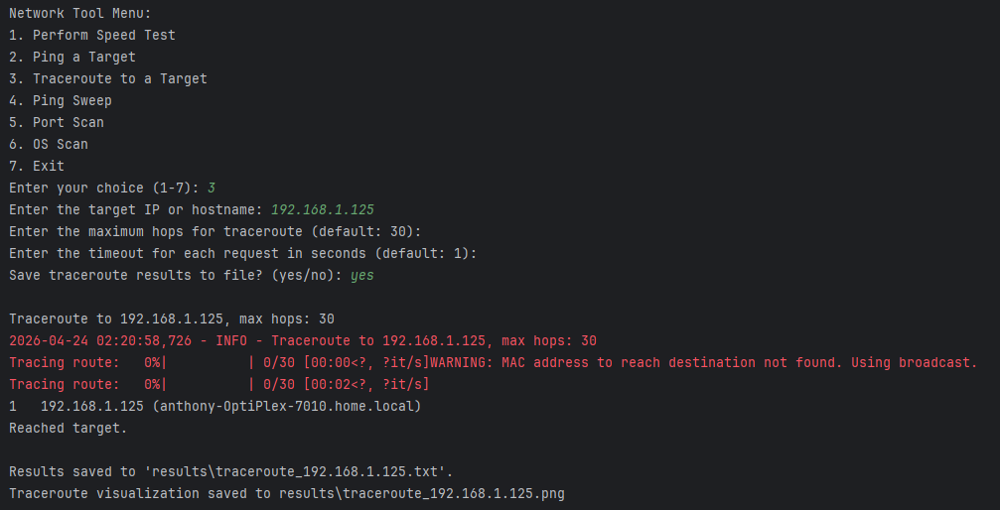

# PyNetTools


A network analysis and diagnostics toolkit built with Python. PyNetTools provides a suite of utilities — ping, traceroute, ping sweep, port scanning, OS detection, and speed testing — via both an interactive menu and a full command-line interface.



---

## Features

| Feature | Description |
|---|---|
| **Speed Test** | Measure download/upload speeds and ping latency |
| **Ping** | Send ICMP echo requests to any host |
| **Traceroute** | Trace the network path with hop-by-hop details and a visual graph |
| **Ping Sweep** | Discover active hosts across a subnet |
| **Port Scan** | Identify open ports and services via Nmap |
| **OS Detection** | Fingerprint the operating system of a remote host |

---

## Requirements

- Python 3.6+
- Administrator / root privileges (required for raw socket features: ping, traceroute, sweep)
- **Windows:** [Npcap](https://npcap.com) — required by Scapy for raw packet capture. During install, enable **"WinPcap API-compatible mode"**.
- **Linux/macOS:** `libpcap` (usually pre-installed; install via `sudo apt install libpcap-dev` or `brew install libpcap` if missing)

---

## Installation

```bash
# 1. Clone the repository
git clone https://github.com/allenmonkey970/pynettools.git
cd pynettools

# 2. (Windows only) Install Npcap from https://npcap.com/#download

# 3. Install Python dependencies
pip install -r requirements.txt
```

---

## Usage

### Interactive mode

```bash
python main.py
```

```
Network Tool Menu:
1. Perform Speed Test
2. Ping a Target
3. Traceroute to a Target
4. Ping Sweep
5. Port Scan
6. OS Scan
7. Exit
```

### Command-line interface

#### Speed test
```bash
python main.py speedtest
```

#### Ping
```bash
python main.py ping <target> [-c COUNT] [-t TIMEOUT]
```
| Flag | Default | Description |
|---|---|---|
| `-c`, `--count` | `4` | Number of packets to send |
| `-t`, `--timeout` | `1` | Per-packet timeout (seconds) |

#### Traceroute
```bash
python main.py traceroute <target> [-m MAX_HOPS] [-t TIMEOUT] [-s]
```
| Flag | Default | Description |
|---|---|---|
| `-m`, `--max-hops` | `30` | Maximum number of hops |
| `-t`, `--timeout` | `1` | Per-probe timeout (seconds) |
| `-s`, `--save` | — | Save results to `results/` |

#### Ping sweep
```bash
python main.py sweep <subnet> [-t TIMEOUT] [--threads N]
```
| Flag | Default | Description |
|---|---|---|
| `-t`, `--timeout` | `1` | Per-host timeout (seconds) |
| `--threads` | `10` | Concurrent threads |

#### Port scan
```bash
python main.py portscan <target> [-p PORTS]
```
| Flag | Default | Description |
|---|---|---|
| `-p`, `--ports` | `1-1024` | Port range (e.g. `1-1024` or `22,80,443`) |

#### OS detection
```bash
python main.py osscan <target>
```

---

## Configuration

Create a `config.json` in the project root to override defaults:

```json
{
  "timeout": 1,
  "max_hops": 30,
  "threads": 10,
  "default_ports": "1-1024"
}
```

---

## Results

All output is saved to the `results/` directory (created automatically, excluded from version control):

| File | Contents |
|---|---|
| `speedtest_results.json` | Download/upload speeds and latency |
| `traceroute_<target>.txt` | Hop-by-hop traceroute output |
| `traceroute_<target>.png` | Traceroute network graph |
| `ping_sweep_<subnet>.txt` | List of live hosts |
| `portscan_<target>.txt` | Open ports and services |
| `osscan_<target>.txt` | OS detection matches |
| `network_tool.log` | Full session log |

---

## Screenshots

### Speed Test


### Traceroute


### Traceroute Visualization


---

## Project Structure

```
PyNetTools/
├── pynettools/
│   ├── __init__.py
│   ├── network_tool.py   # NetworkTool class
│   └── subnets.py        # Subnet utilities
├── screenshots/          # README screenshots
├── results/              # Runtime output (gitignored)
├── main.py               # Entry point
├── config.json           # Optional configuration
├── requirements.txt
└── LICENSE
```

---

## Disclaimer

This tool is intended for network diagnostics and educational purposes only. Always ensure you have explicit authorization before scanning networks or hosts you do not own.

---

## License

This project is licensed under the MIT License — see [LICENSE](LICENSE) for details.

---

## Contributing

Contributions, issues, and feature requests are welcome. Check the [issues page](https://github.com/allenmonkey970/pynettools/issues).

1. Fork the project
2. Create your feature branch: `git checkout -b feature/my-feature`
3. Commit your changes: `git commit -m 'Add my feature'`
4. Push to the branch: `git push origin feature/my-feature`
5. Open a Pull Request
